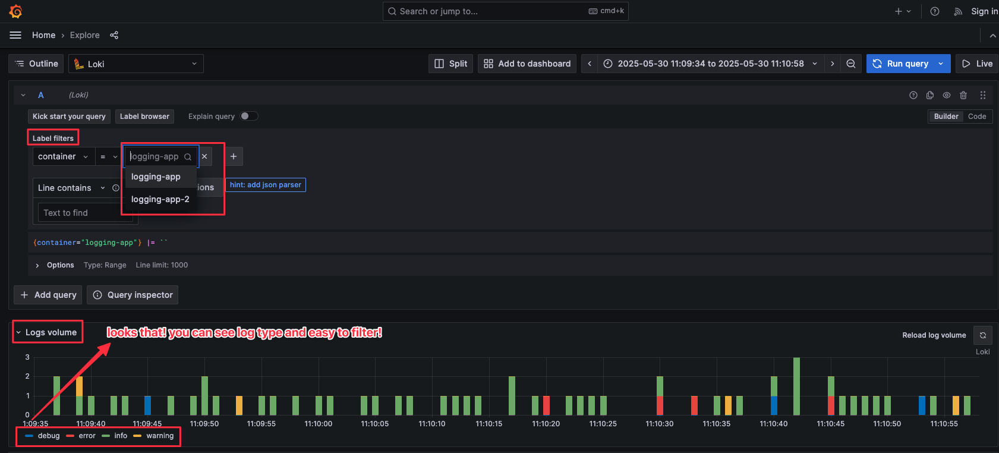
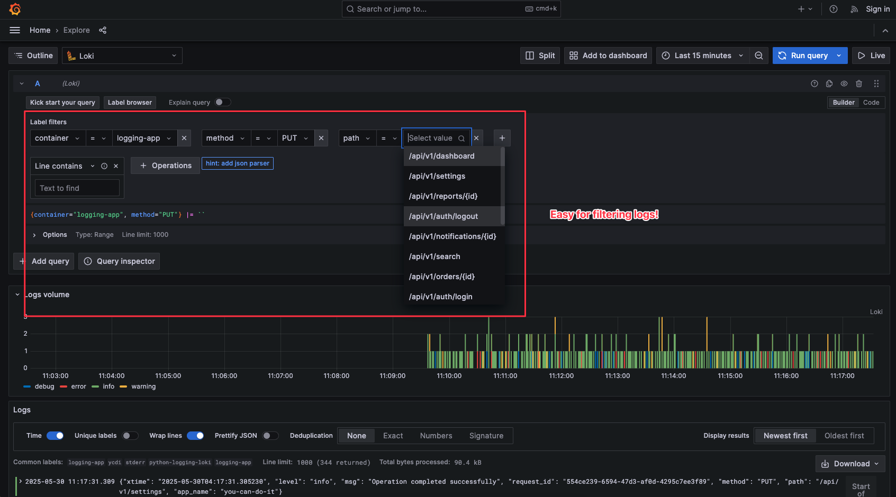
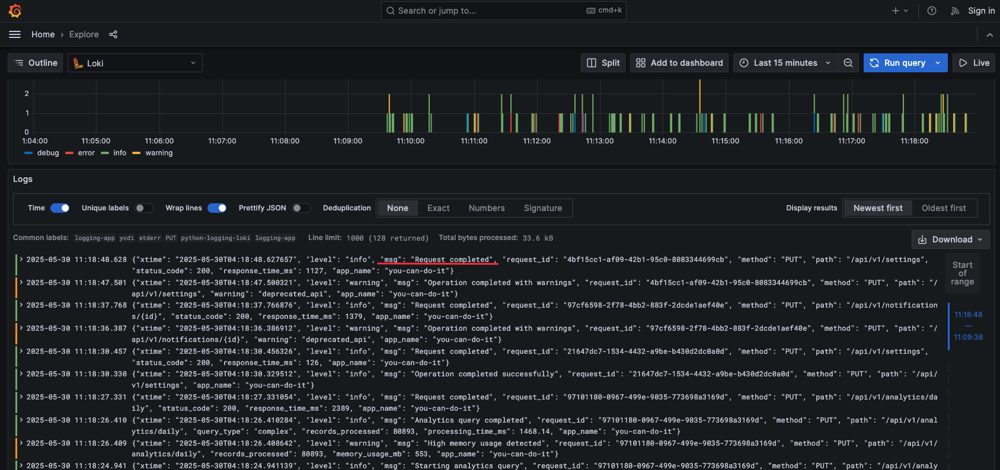
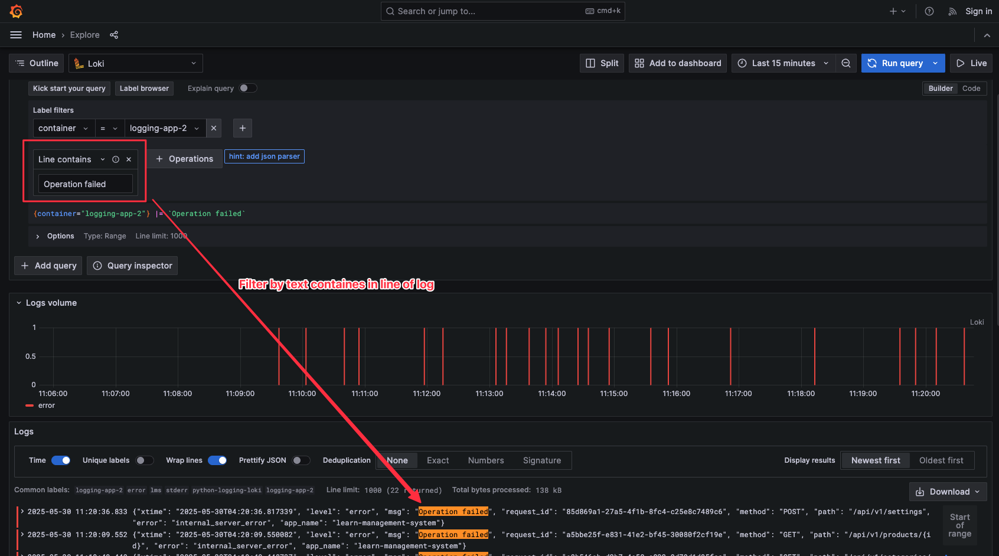
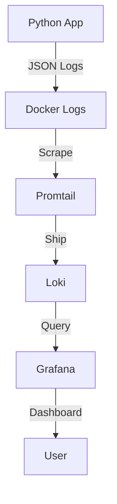

# 🚀 Python Logging with Loki + Grafana

A modern centralized logging system for Python apps using the latest observability stack:
- **Python** with structlog (structured logging)
- **Loki** (log aggregation & storage)
- **Promtail** (log shipper)
- **Grafana** (visualization & dashboards)

## 📋 What You'll Learn

This tutorial will teach you:
1. ✅ **Structured Logging** with Python structlog
2. ✅ **Log Aggregation** using Loki
3. ✅ **Log Shipping** with Promtail
4. ✅ **Real-time Visualization** in Grafana
5. ✅ **Business Logic Simulation** for testing

---

## 🔍 Dashboard Grafana Result
<details>
<summary>Click to show demo loki</summary>





</details>

---

## 🗂️ Project Structure

```
python-logging-loki/
├── app/                          # 🐍 Python application
│   ├── main.py                   # Entry point & request simulation
│   ├── business_logic.py         # Simulated business operations
│   └── log_config.py             # structlog configuration
├── config/                       # ⚙️ Service configurations
│   ├── loki-config.yml           # Loki configuration
│   ├── promtail-config.yml       # Promtail log collection rules
│   ├── grafana-datasources.yml   # Grafana data sources
│   └── grafana-dashboards.yml    # Dashboard provisioning
├── dashboards/                   # 📊 Grafana dashboards
│   └── structlog-dashboard.json
├── docker-compose.yml            # 🐳 Orchestration
└── Dockerfile                    # 📦 Python app container
```

---

## 🔄 How the System Works



### Flow Details:

1. **🐍 Python App** → Generates structured JSON logs using structlog
2. **📋 Promtail** → Reads logs from Docker containers in real-time
3. **🗄️ Loki** → Stores and indexes logs for fast querying
4. **📊 Grafana** → Displays logs in interactive dashboards

---

## 🚀 Quick Start (5-Minute Setup!)

### Prerequisites
- Docker & Docker Compose installed
- Port 3000 (Grafana) available

### 1. Clone & Run
```bash
# Clone this repository
cd python-logging-loki

# Start all services
docker-compose up --build
```

### 2. Access the Dashboard
- 🌐 **Grafana**: http://localhost:3000
- 📊 **Dashboard**: Pre-provisioned and ready to use
- 🔍 **Loki**: http://localhost:3100 (API)
- 📋 **Promtail**: http://localhost:9080 (metrics)

### 3. View Real-time Logs
The dashboard instantly shows:
- ✅ Request logs with response times
- ✅ Error tracking and alerts
- ✅ Business operation metrics
- ✅ User activity patterns

---

## 📱 Business Logic Simulation

This app simulates real-world business scenarios:

### 🧑‍💼 User Operations
```python
# User registration with validation
simulate_user_registration(user_data)

# Authentication with security logging
simulate_authentication(username, password)
```

### 🛒 E-commerce Operations  
```python
# Order processing with inventory & payment
simulate_order_processing(order_data)

# File upload with virus scanning
simulate_file_upload(filename, file_size)
```

### 📊 Analytics & Performance
```python
# Data analytics with performance monitoring
simulate_data_analytics(query_type)
```

### 🎯 Log Types Generated:
- **INFO**: Successful operations
- **WARNING**: Business logic warnings
- **ERROR**: System/business errors  
- **DEBUG**: Development details

---

## ⚙️ Service Configuration

### 🐍 Python App (`app/`)
- **structlog**: Structured JSON logging
- **Rotating logs**: Auto cleanup (10MB files)
- **Sensitive data masking**: Password/token masking
- **Request tracing**: UUID-based request tracking

### 📋 Promtail (`config/promtail-config.yml`)
```yaml
# Key features:
- Docker log discovery
- JSON parsing
- Label extraction
- Health check filtering
- Timestamp parsing
```

### 🗄️ Loki (`config/loki-config.yml`)
- **Retention**: 30 days by default
- **Indexing**: Optimized for JSON logs
- **Performance**: Great for development

### 📊 Grafana (`config/`)
- **Auto-provisioning**: Data sources & dashboards
- **Anonymous access**: No login required
- **Custom dashboard**: Pre-built for structlog


---

## 📖 References

- 📘 [Loki Documentation](https://grafana.com/docs/loki/latest/)
- 📘 [Promtail Configuration](https://grafana.com/docs/loki/latest/clients/promtail/)
- 📘 [Grafana Dashboards](https://grafana.com/docs/grafana/latest/)
- 📘 [Structlog Guide](https://structlog.org/)
- 📘 [Docker Compose](https://docs.docker.com/compose/)
- 📘 [Logging with docker promtail and grafana loki](https://ruanbekker.medium.com/logging-with-docker-promtail-and-grafana-loki-d920fd790ca8)