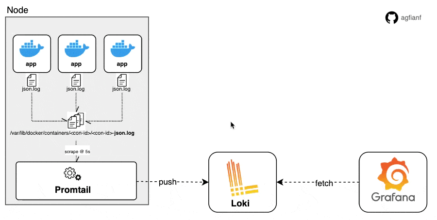
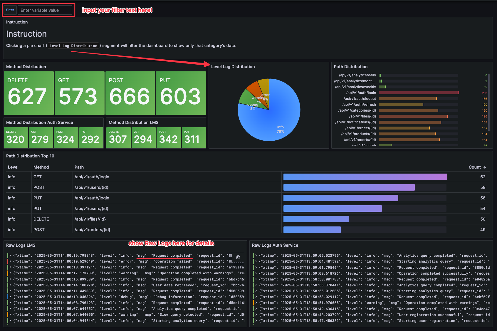
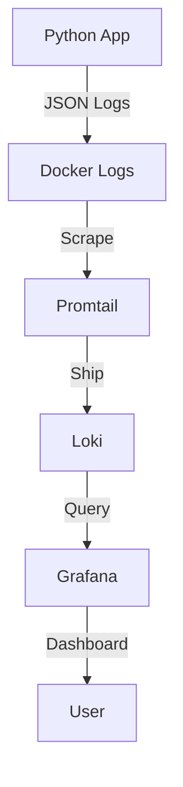
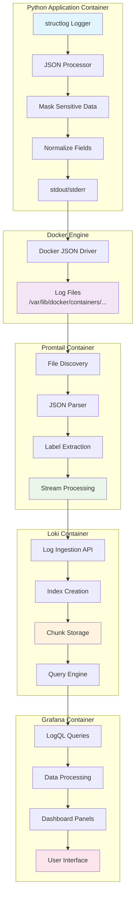

# 🚀 Python Logging with Loki + Grafana



A modern centralized logging system for Python apps using the latest observability stack:
- **Python** with structlog (structured logging)
- **Loki** (log aggregation & storage)
- **Promtail** (log shipper)
- **Grafana** (visualization & dashboards)

## 📋 What You'll Learn

This tutorial will teach you:
1. ✅ **Structured Logging** with Python structlog
2. ✅ **Log Aggregation** using Loki
3. ✅ **Log Shipping** with Promtail
4. ✅ **Real-time Visualization** in Grafana
5. ✅ **Business Logic Simulation** for testing

## Running this:

```bash
make up
# or 
docker-compose up --build
```


---

## 🔍 Dashboard Grafana Result


<details>
<summary>Click to show demo loki</summary>


</details>

---

## 🗂️ Project Structure

```
python-logging-loki/
├── app/                          # 🐍 Python application
│   ├── main.py                   # Entry point & request simulation
│   ├── business_logic.py         # Simulated business operations
│   └── log_config.py             # structlog configuration
├── config/                       # ⚙️ Service configurations
│   ├── loki-config.yml           # Loki configuration
│   ├── promtail-config.yml       # Promtail log collection rules
│   ├── grafana-datasources.yml   # Grafana data sources
│   └── grafana-dashboards.yml    # Dashboard provisioning
├── dashboards/                   # 📊 Grafana dashboards
│   └── structlog-dashboard.json
├── docker-compose.yml            # 🐳 Orchestration
└── Dockerfile                    # 📦 Python app container
```

---

## 🔄 How the System Works



## 📊 Detailed Logging Journey
<details>
<summary>Click to expand</summary>

### 🛤️ Complete Log Flow Diagram



### 🔍 Step-by-Step Log Journey

#### 1️⃣ **Python App → structlog Processing**
```
📝 Code Execution
    ↓
🔧 structlog Processors:
    • mask_sensitive_processor()     → Hide passwords/tokens
    • normalize_high_cardinality()   → Replace UUIDs with {uid}
    • TimeStamper()                  → Add ISO timestamp
    • JSONRenderer()                 → Convert to JSON
    ↓
📤 Output to stdout/stderr
```

**Example Log Output:**
```json
{
  "xtime": "2024-01-15T10:30:45.123456",
  "level": "info",
  "msg": "User login successful",
  "request_id": "req-123",
  "user_id": 456,
  "method": "POST",
  "path": "/api/v1/auth/login",
  "password": "***MASKED***"
}
```

#### 2️⃣ **Docker → Log Capture**
```
🐳 Docker Container
    ↓
📋 JSON File Driver
    ↓
💾 File Storage: /var/lib/docker/containers/{container_id}/{container_id}-json.log
```

**Docker Log Format:**
```json
{
  "log": "{\"xtime\":\"2024-01-15T10:30:45.123456\",\"level\":\"info\"...}\n",
  "stream": "stdout",
  "time": "2024-01-15T10:30:45.123456789Z"
}
```

#### 3️⃣ **Promtail → Log Collection**
```
🔍 Docker Service Discovery
    ↓
📂 File Monitoring (/var/lib/docker/containers/**/*.log)
    ↓
🏷️ Label Extraction from Docker containers:
    • container_name
    • logging_jobname (from labels)
    • logging="promtail" (filter)
    ↓
📊 JSON Parsing & Stream Processing
    ↓
🚀 HTTP Push to Loki API
```

**Promtail Processing:**
- **Discovery**: Auto-detect containers with `logging: "promtail"` label
- **Parsing**: Extract JSON from Docker's nested format
- **Labeling**: Add metadata (job, container, etc.)
- **Streaming**: Real-time push to Loki

#### 4️⃣ **Loki → Log Storage**
```
📨 HTTP API Ingestion (/loki/api/v1/push)
    ↓
🏷️ Index Creation (based on labels):
    • job="jobname-auth-service"
    • container_name="auth-service"
    • level="info"
    ↓
📦 Chunk Creation (grouped by time + labels)
    ↓
💾 Storage (local filesystem or cloud)
```

**Loki Storage Structure:**
```
chunks/
├── fake/
│   └── {chunk-id}/
│       ├── {time-range}-{hash}.gz  # Compressed log data
│       └── index                   # Label index
```

#### 5️⃣ **Grafana → Visualization**
```
🔍 LogQL Query:
    {job="jobname-auth-service"} |= "login" | json | level="info"
    ↓
📊 Query Engine Processing
    ↓
📈 Panel Rendering:
    • Time series graphs
    • Log tables
    • Stat panels
    ↓
🖥️ Dashboard Display
```


### 🔧 Data Transformation Examples

#### Raw Python Log → Final Grafana Display

**1. Python structlog:**
```python
logger.info("Order processed", 
    order_id="order-550e8400-e29b-41d4-a716-446655440000",
    user_id=123,
    amount=99.99,
    payment_method="credit_card")
```

**2. After structlog processing:**
```json
{
  "xtime": "2024-01-15T10:30:45.123456",
  "level": "info", 
  "msg": "Order processed",
  "order_id": "order-{uid}",  // ← Normalized!
  "user_id": 123,
  "amount": 99.99,
  "payment_method": "credit_card"
}
```

**3. Docker wrapping:**
```json
{
  "log": "{\"xtime\":\"2024-01-15T10:30:45.123456\",\"level\":\"info\"...}\n",
  "stream": "stdout",
  "time": "2024-01-15T10:30:45.123456789Z"
}
```

**4. Promtail adds labels:**
```json
{
  "streams": [{
    "stream": {
      "job": "jobname-auth-service",
      "container_name": "auth-service",
      "level": "info"
    },
    "values": [["1705315845123456000", "{\"xtime\":\"2024-01-15T10:30:45.123456\"...}"]]
  }]
}
```

**5. Grafana LogQL query:**
```logql
{job="jobname-auth-service"} 
|= "Order processed" 
| json 
| amount > 50
```

### ⚡ Performance & Optimization

```
📊 Throughput Capacity:
┌─────────────┬──────────────┬─────────────┐
│ Component   │ Logs/Second  │ Bottleneck  │
├─────────────┼──────────────┼─────────────┤
│ structlog   │ 10,000+      │ CPU         │
│ Docker      │ 5,000+       │ Disk I/O    │
│ Promtail    │ 3,000+       │ Network     │
│ Loki        │ 2,000+       │ Storage     │
│ Grafana     │ 1,000+       │ UI Render   │
└─────────────┴──────────────┴─────────────┘
```

</details>


### Flow Details:

1. **🐍 Python App** → Generates structured JSON logs using structlog
2. **📋 Promtail** → Reads logs from Docker containers in real-time
3. **🗄️ Loki** → Stores and indexes logs for fast querying
4. **📊 Grafana** → Displays logs in interactive dashboards

---

## 🚀 Quick Start (5-Minute Setup!)

### Prerequisites
- Docker & Docker Compose installed
- Port 3000 (Grafana) available

### 1. Clone & Run
```bash
# Clone this repository
cd python-logging-loki

# Start all services
docker-compose up --build
```

### 2. Access the Dashboard
- 🌐 **Grafana**: http://localhost:3000
- 📊 **Dashboard**: Pre-provisioned and ready to use
- 🔍 **Loki**: http://localhost:3100 (API)
- 📋 **Promtail**: http://localhost:9080 (metrics)

### 3. View Real-time Logs
The dashboard instantly shows:
- ✅ Request logs with response times
- ✅ Error tracking and alerts
- ✅ Business operation metrics
- ✅ User activity patterns

---

## 📱 Business Logic Simulation

This app simulates real-world business scenarios:

### 🧑‍💼 User Operations
```python
# User registration with validation
simulate_user_registration(user_data)

# Authentication with security logging
simulate_authentication(username, password)
```

### 🛒 E-commerce Operations  
```python
# Order processing with inventory & payment
simulate_order_processing(order_data)

# File upload with virus scanning
simulate_file_upload(filename, file_size)
```

### 📊 Analytics & Performance
```python
# Data analytics with performance monitoring
simulate_data_analytics(query_type)
```

### 🎯 Log Types Generated:
- **INFO**: Successful operations
- **WARNING**: Business logic warnings
- **ERROR**: System/business errors  
- **DEBUG**: Development details

---

## ⚙️ Service Configuration

### 🐍 Python App (`app/`)
- **structlog**: Structured JSON logging
- **Rotating logs**: Auto cleanup (10MB files)
- **Sensitive data masking**: Password/token masking
- **Request tracing**: UUID-based request tracking

### 📋 Promtail (`config/promtail-config.yml`)
```yaml
# Key features:
- Docker log discovery
- JSON parsing
- Label extraction
- Health check filtering
- Timestamp parsing
```

### 🗄️ Loki (`config/loki-config.yml`)
- **Retention**: 30 days by default
- **Indexing**: Optimized for JSON logs
- **Performance**: Great for development

### 📊 Grafana (`config/`)
- **Auto-provisioning**: Data sources & dashboards
- **Anonymous access**: No login required
- **Custom dashboard**: Pre-built for structlog

---

## 📖 References

- 📘 [Loki Documentation](https://grafana.com/docs/loki/latest/)
- 📘 [Promtail Configuration](https://grafana.com/docs/loki/latest/clients/promtail/)
- 📘 [Grafana Dashboards](https://grafana.com/docs/grafana/latest/)
- 📘 [Structlog Guide](https://structlog.org/)
- 📘 [Docker Compose](https://docs.docker.com/compose/)
- 📘 [Logging with docker promtail and grafana loki](https://ruanbekker.medium.com/logging-with-docker-promtail-and-grafana-loki-d920fd790ca8)
- 📘 [Docker SD Configs on Promtail](https://grafana.com/docs/loki/latest/send-data/promtail/configuration/#docker_sd_configs)
- 📺 [YouTube: 6 Easy Ways to Improve your Log Dashboards with Grafana and Loki](https://www.youtube.com/watch?v=EPLvB1eVJJk)
- 📖 [Blog: Setup Grafana and Loki](https://blog.quentin-favrie.net/2021/05/31/setup-grafana-and-loki/)